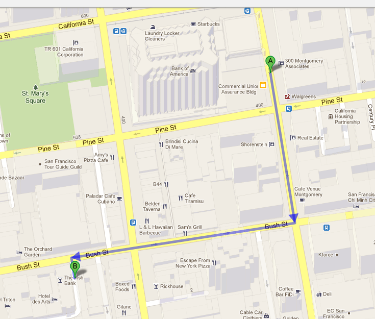

<!SLIDE bullets incremental>
# You have completed the RailsBridge Intermediate Workshop!
* Congratulations!

<!SLIDE bullets>
# Celebrate!
* After-party at The Irish Bank

<!SLIDE bullets>
# What did we learn?
* TDD
* Gems
* Rails in Depth
* ???

<!SLIDE bullets>
# What should you do next?
* Continue improving your app
* Come to another intermediate workshop
* Volunteer!

<!SLIDE bullets>
# Resources:
* Awesome resource sheet with pretty fonts: <http://tiny.cc/railsbridge_learn_more>
* <http://installfest.railsbridge.org/workshop/resources>
* Want to organize a workshop? join railsbridge-workshops@googlegroups.com

<!SLIDE bullets>
# RIGHT NOW
* TAKE THIS SURVEY RIGHT NOW: http://tiny.cc/railsbridge_survey
