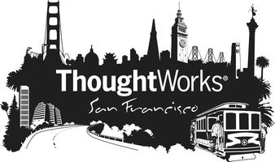

<!SLIDE bullets incremental>
# Welcome to the RailsBridge Intermediate Workshop!

<!SLIDE bullets>
# Your Hosts

<!SLIDE bullets>
# What is this intermediate curriculum all about?
* Learning more about the moving parts of a Rails app
 * Models
 * Views
 * Controllers
* Less about copying and pasting commands
* More about discovery
* Figuring out problems on your own
 * error messages are guide posts, not scary!

<!SLIDE bullets>
# This curriculum is a work in progress
* Please fill out the survey at the end with your feedback so we can improve it

<!SLIDE bullets>
# Schedule
* 9:00-9:30 Introductions & Coffee
* 9:30-10:00 Intro (You are here)
* 10:00-10:50 Session 1
* 10:50-11:00 Quick Break
* 11:00-12:00 Session 2
* 12:00-1:00 Lunch
* 1:00-2:15 Session 3
* 2:15-2:30 Quick Break
* 2:30-3:30 Session 4
* 3:30-4:00 Wrap up & final questions
* 4:00 Grab a drink (or 2 or 3?) at Irish Bank (Mark Lane on Bush between Kearney and Grant) 

<!SLIDE bullets>
# What now?
* We'll assign the teachers
* Grab a last minute coffee

